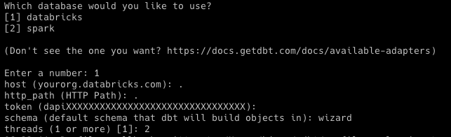

Welcome to your [Spellbook](https://youtu.be/o7p0BNt7NHs). Cast a magical incantation to tame the blockchain.

## Intro

Write SQL to transform blockchain data into curated datasets on [dune.com](https://dune.com/home).

First-time visitor? Check out how to [get started](##-getting-started) below and visit the Spellbook [tutorial](https://docs.dune.com/dune-engine-v2-beta/abstractions-in-dunev2/how-to-contribute-a-spell). More tk.

Been here before? An archive of intermediate datasets that were contributed for for Dune v1 can be consulted [here](deprecated-dune-v1-abstractions).

## Getting Started

### Prerequisites
- Fork this repo and clone your fork locally. See Github's [guide](https://docs.github.com/en/get-started/quickstart/contributing-to-projects) on contributing to projects.
- python 3.9 installed. Our recommendation is to follow the [Hitchhiker's Guide to Python](https://docs.python-guide.org/starting/installation/)
- [pip](https://pip.pypa.io/en/stable/installation/) installed
- [pipenv](https://pypi.org/project/pipenv/) installed
- paths for both pip and pipenv are set (this should happen automatically but sometimes does not). If you run into issues like "pipenv: command not found", try troubleshooting with the pip or pipenv documentation.

### Initial Installation
You can watch the video version of this if you scroll down a bit.

Navigate to the abstraction repo within your CLI (Command line interface).
```
cd user\directory\github\spellbook
#change this to whereever spellbook are stored locally on your machine
```
Use the pipfile to create a pipenv.
```
pipenv install
```
If the env is created successfully, skip ahead to `pipenv shell`.

Our script is looking for a static python version, the likelihood of an error for a wrong python version is pretty high. If that error occurs, check your python version with:
```
py --version
```
Now use any text editor program to change the python version in the pipfile within the spellbook directory to your python version. You need to have at least python 3.9.
If you have changed the python version in the pipfile, run `pipenv install` again.

You are now ready to activate this project's virtual environment.
Use:
```
pipenv shell
```
You have now created a virtual environment for this project. You can read more about virtual environments [here](https://realpython.com/pipenv-guide/).

To initiate the dbt project run:
```
dbt init
```
Enter the values as shown below:

.

This will not connect to the database but you have access to some dbt actions.
**When you are prompted to choose a schema, please enter `wizard` so we know you are an external contributor.**
Should you make an error during this process (not entering `wizard` being the only one you can make), simply quit the CLI and start over.

Then, run the following command:
```
dbt compile
```
dbt compile will compile the JINJA and SQL templated SQL into plain SQL which can be executed in the Dune UI. Your spellbook directory now has a folder named `target` containg plain SQL versions of all models in Dune. If you have made changes to the repo before completing all these actions, you can now be certain that at least the compile process works correctly, if there is big errors the compile process will not complete.
If you haven't made changes to the directory beforehand, you can now start adding, editing or deleting files within the repository.
Afterwards simply run `dbt compile` again once you are finished with your work in the directory and test the plain language sql queries on dune.com.

### Coming back
If you have done these installation on your machine once, to get back into dbt, simply navigate to the spellbook repo, run `pipenv shell`, and you can run `dbt compile` again.

### What did I just do?
You now have the ability to compile your dbt model statements and test statements into plain SQL. This allows you to test those queries on the usual dune.com environment and should therefore lead to a better experience while developing spells. Running the queries will immediately give you feedback on typos, logical errors or mismatches.
This in turn will help us deploy these spells faster and avoid any potential mistakes.

We are thinking about better solutions to make more dbt actions available directly but we also have to consider security.

### How to use dbt to create spells

There's a couple new concepts to consider when making spells in dbt. The most common ones wizards will encounter are refs, sources, freshness, and tests.

In the body of each query, tables are referred to either as refs, ex `{{ ref('1inch_ethereum') }}` or sources, ex `{{ source('ethereum', 'traces') }}`. Refs refer to other dbt models and they should refer to the file name like `1inch_ethereum.sql`, even if the model itself is aliased. Sources refer to "raw" data or tables/views not generated by dbt. Using refs and sources allows us to automatically build dependency trees.

Sources and models are defined in schema.yml files where tests and other attributes are defined.

Best practice is to add tests unique and non_null tests to the primary key for every new model. Similarly, a freshness check should be added to every new source (although we will try not to re-test freshness if the source is used elsewhere).

Adding descriptions to tables and columns will help people find and use your tables.

```
models:
  - name: 1inch_ethereum
    description: "Trades on 1inch, a DEX aggregator"
    columns:
      - name: tx_hash
        description: "Table primary key: a transaction hash (tx_hash) is a unique identifier for a transaction."
        tests:
          - unique
          - not_null

  sources:
  - name: ethereum
    freshness:
      warn_after: { count: 12, period: hour }
      error_after: { count: 24, period: hour }
    tables:
      - name: traces
        loaded_at_field: block_time
```

See links to more docs on dbt below.

### Generating and serving documentation:
To generate documentation and view it as a website, run the following commands:
- `dbt docs generate`
- `dbt docs serve`
You must have set up dbt with `dbt init` but you don't need database credentials to run these commands.

See [dbt docs documentation](https://docs.getdbt.com/docs/building-a-dbt-project/documentation) for more information on
how to contribute to documentation.

As a preview, you can do [things](https://docs.getdbt.com/reference/resource-properties/description) like:
- Write simple one or many line descriptions of models or columns.
- Write longer descriptions as code blocks using markdown.
- Link to other models in your descriptions.
- Add images / project logos from the repo into descriptions.
- Use HTML in your description.


### Troubleshooting

If you fail to run `dbt compile` with `Could not find profile named 'spellbook'` as the error message, check `~/.dbt/profiles.yml` and make sure there is a profile named `spellbook`. When you run `dbt init` to initiate a project, a profile gets created. Inside `spellbook` you cannot initiate a project called the same name, so you need to run `dbt init spellbook` outside the project so it creates the profile, or create one with a different name and then manually edit the `profiles.yml` file.

### DBT Resources:
- Learn more about dbt [in the docs](https://docs.getdbt.com/docs/introduction)
- Check out [Discourse](https://discourse.getdbt.com/) for commonly asked questions and answers
- Join the [chat](https://community.getdbt.com/) on Slack for live discussions and support
- Find [dbt events](https://events.getdbt.com) near you
- Check out [the blog](https://blog.getdbt.com/) for the latest news on dbt's development and best practices
