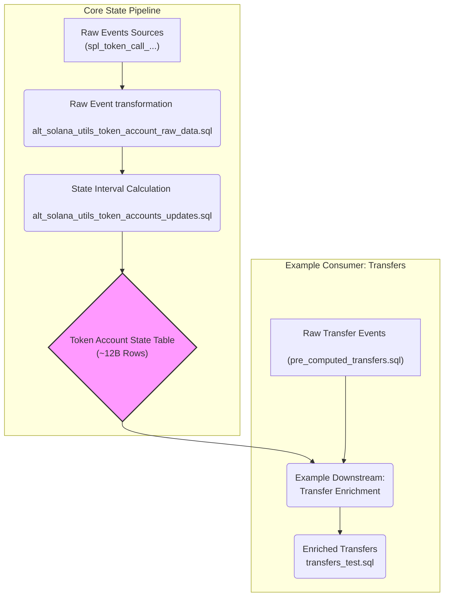

# Solana Token Account State Pipeline Overview

This document outlines the dbt pipeline designed to track the state (owner, mint address) of Solana token accounts over time, identifies performance bottlenecks in the incremental update process, and discusses potential solutions.

## Pipeline Overview

The pipeline is designed to track the state of Solana token accounts over time. It consists of the following stages:

1. **Raw Events Sources:**
2. **Transformation of Raw Events to Partitioned Table:**
3. **State Interval Calculation:**


We need to calculate the state of any token account at a given point in time in order to enrich the transfer events with the correct owner and mint address.




## Pipeline Stages

The core pipeline consists of the following dbt models:

1.  **Raw Event Aggregation:**
    *   **File:** [`dbt_subprojects/solana/models/solana_utils/new_token_accounts_pipeline/spl_tokens/alt_solana_utils_token_account_raw_data.sql`](https://github.com/duneanalytics/spellbook/blob/token_accounts_sorting/dbt_subprojects/solana/models/solana_utils/new_token_accounts_pipeline/spl_tokens/alt_solana_utils_token_account_raw_data.sql)
    *   **Purpose:** Collects all relevant events (initialization, owner changes, closures) that affect a token account's state from various source tables (`spl_token_call_initializeaccount*`, `spl_token_call_setauthority`, `spl_token_call_closeaccount`).
    *   **Output:** A table containing raw events, timestamped and associated with a `token_account`. Includes partitioning keys `token_account_prefix` and `block_year`.

2.  **State Interval Calculation:**
    *   **File:** [`dbt_subprojects/solana/models/solana_utils/new_token_accounts_pipeline/spl_tokens/alt_solana_utils_token_accounts_updates.sql`](https://github.com/duneanalytics/spellbook/blob/token_accounts_sorting/dbt_subprojects/solana/models/solana_utils/new_token_accounts_pipeline/spl_tokens/alt_solana_utils_token_accounts_updates.sql)
    *   **Purpose:** Processes the raw events using window functions (`MAX OVER`, `LEAD OVER`) partitioned by `token_account` and ordered by a composite `instruction_uniq_id`. It calculates the time intervals (`valid_from`, `valid_to`, `valid_from_instruction_uniq_id`, `valid_to_instruction_uniq_id`) during which a specific owner and mint address combination is valid for each token account.
    *   **Output:** A large state table (~12 Billion rows) detailing the historical state of every token account, partitioned by `token_account_prefix` and `valid_from_year` for efficient downstream joining. This table is the primary output of the core state-tracking logic.

## The Performance Problem

The fundamental challenge stems from the combination of **massive data scale** (~12 Billion rows in the target state table) and the **stateful nature of the calculations**.

*   **Scale & Statefulness:** The `alt_solana_utils_token_accounts_updates` model must process the entire history of events for each token account to correctly determine ownership and mint intervals using window functions. For example, it uses functions like:

    ```sql
    -- Actual Window Functions from alt_solana_utils_token_accounts_updates.sql:
    MAX(CASE WHEN account_mint IS NOT NULL THEN account_mint END)
      OVER (
        PARTITION BY token_account
        ORDER BY instruction_uniq_id ASC
        ROWS BETWEEN UNBOUNDED PRECEDING AND CURRENT ROW
      ) AS last_non_null_account_mint,
    
    LEAD(block_time, 1) OVER (PARTITION BY token_account ORDER BY instruction_uniq_id ASC) AS next_block_time,
    LEAD(instruction_uniq_id, 1) OVER (PARTITION BY token_account ORDER BY instruction_uniq_id ASC) AS next_instruction_uniq_id
    ```

    Full refreshes are possible but computationally expensive (e.g., ~24 minutes on 10 r16x workers), making frequent runs impractical in production.
*   **Incremental Necessity:** This necessitates an incremental approach. However, the stateful logic imposes constraints:
    *   **Limited Input Filtering:** To ensure correctness, any incremental run must still process the *full history* for *all token accounts* that have received *any new event* since the last run. While optimizations select *only* these affected accounts, the required historical data can still be substantial.
    *   **Delta/Trino Write Bottleneck:** The primary performance killer occurs when writing the incremental results to the target Delta table using Trino. Strategies like `delete+insert` (or `merge`), required for correctness using the `unique_key`, force Trino to scan large portions of the 12B-row target table to find and delete/update existing rows. This scan operation is extremely slow (~18 minutes in example runs), dominating the incremental job time and negating the benefits of processing only new/affected data.
*   **Non-Viable Alternative:** Running without the `unique_key` check avoids the slow delete/merge scan (~5 mins) but introduces data duplication, making it unusable.
*   **Desired Behavior (Unavailable):** Ideally, we'd overwrite entire partitions affected by the incremental data. While Parquet + `insert_overwrite` allows this, the Trino Delta connector lacks this capability, forcing reliance on the slow row-level operations inherent to Delta's ACID transaction log management.

## Potential Solutions & Trade-offs

1.  **Spend more money (short-term):** Current model configuration is unacceptably slow for production incremental runs on current hardware. While costs to scale up to acceptable performance are high, this is an acceptable temporary solution for a few weeks until engineering resources become available to implement a proper fix.
2. **Run model on Databricks:** Databricks has a more efficient Delta connector that supports partition overwrites. This would allow us to use the `insert_overwrite` strategy. It might also be possible that databricks has a more efficient way to run merge or delete+insert statements. We don't know how well databricksSQL handles the rest of the operations.


## Example Downstream Usage

These models demonstrate how the `alt_solana_utils_token_accounts_updates` state table can be consumed:

1.  **Transfer Event Preparation:**
    *   **File:** [`dbt_subprojects/solana/models/_sector/transfers/transfer_tests/pre_computed_transfers.sql`](https://github.com/duneanalytics/spellbook/blob/token_accounts_sorting/dbt_subprojects/solana/models/_sector/transfers/transfer_tests/pre_computed_transfers.sql)
    *   **Purpose:** Prepares raw transfer events, adding partitioning and the `instruction_uniq_id`.

2.  **State Enrichment:**
    *   **File:** [`dbt_subprojects/solana/models/_sector/transfers/transfer_tests/transfers_test.sql`](https://github.com/duneanalytics/spellbook/blob/token_accounts_sorting/dbt_subprojects/solana/models/_sector/transfers/transfer_tests/transfers_test.sql)
    *   **Purpose:** Joins the transfer events (`pre_computed_transfers`) with the state table (`alt_solana_utils_token_accounts_updates`) based on the `token_account` and the `instruction_uniq_id` falling within the `valid_from`/`valid_to` intervals. This enriches transfers with the owner and mint address at the time of the transfer. The joins leverage the partitioning keys for efficiency.

---

The most promising path for performance improvement involves switching the state table to Parquet and using `insert_overwrite`, but this requires careful consideration and acceptance of the trade-off regarding ACID guarantees.
