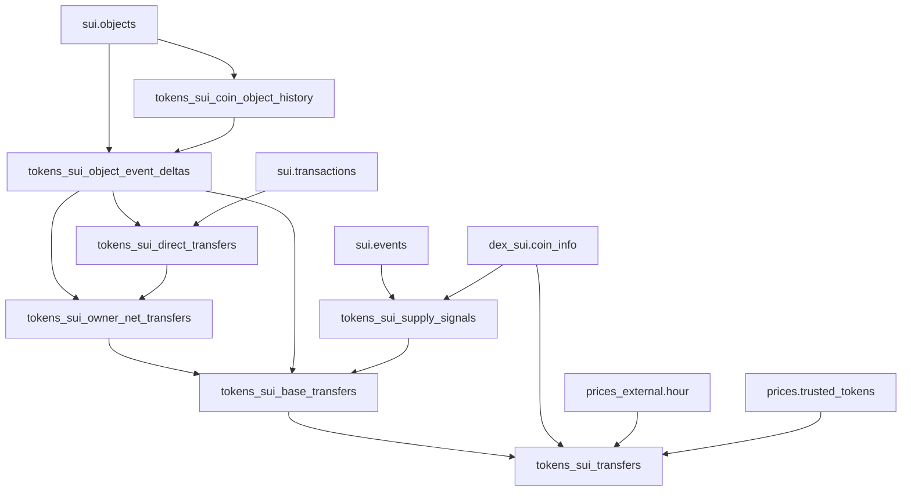

# Sui Transfers Lineage Summary

This lineage builds Sui fungible `Coin<T>` transfers in layered, idempotent steps.

## High-level flow

- `tokens_sui_coin_object_history`: base coin-object history (`Created`/`Mutated`) from `sui.objects`.
- `tokens_sui_object_event_deltas`: reconstructs full object timeline (including `Deleted` + anchors) and computes ownership/balance deltas.
- `tokens_sui_direct_transfers`: extracts direct cross-address debit/credit entries, with deferred `tx_sender` lookup from `sui.transactions`.
- `tokens_sui_owner_net_transfers`: reconciles direct debit/credit entries with residual owner deltas so tx+coin owner-net balances match.
- `tokens_sui_supply_signals`: classifies mint/burn signals from `sui.events` (treasury + CCTP patterns).
- `tokens_sui_base_transfers`: final base transfer dataset (typed transfer labels + supply flags + tx reconciliation metrics).
- `tokens_sui_transfers`: consumer-facing final table enriched with symbols/decimals/prices/trusted-token logic.

## Dependency graph

## Design intent

- Keep heavy logic in focused helper models to simplify reasoning and reviews.
- Keep each stage idempotent and merge-safe for incremental runs.
- Preserve a stable final contract in `tokens_sui_transfers`.

